# Proyecto Intermodular PROMETEO: Infraestructura de Red
> Diseño, implementación y documentación de red corporativa para BugiSoft (1º ASIR).

# 1. Análisis de necesidades del sistema

En este apartado vamos a ver qué sistemas operativos hacen falta para darle vida a **BugiSoft**, mi estudio ficticio dedicado a crear videojuegos de gran presupuesto (AAA) y mantener juegos como servicio (Live Service):

### ● Sistema operativo para servidores
Para cubrir las necesidades de los servidores la decision es bastante facil:

* **Elección:** **Ubuntu Server 24.04 LTS** para el servidor web.
* **Justificación:**
    * **Rendimiento y Estabilidad:** Ubuntu Server es ideal para el servidor web ya que nos da un entorno , ligero , de bajo coste y eficiente para alojar los servicios online de los videojuegos.

### ● Sistema operativo para equipos de usuario
Los puestos de trabajo de las distintas áreas de la empresa requieren un entorno que equilibre la potencia de desarrollo con la facilidad de gestión administrativa:

* **Elección:** **Windows 11 Pro**.
* **Justificación:**
    * **Compatibilidad :** Es el sistema estándar para el desarrollo de videojuegos, asegurando la compatibilidad nativa con motores gráficos profesionales .
    * **Centralizado:** La versión **Pro** es necesaria para integrar los equipos en el dominio del servidor, permitiendo aplicar políticas de seguridad.
    * **Entorno Administrativo:** Ofrece la mejor compatibilidad para las tareas de ofimática y gestión de los departamentos de **Administración** y **Dirección**.

### ● Sistemas específicos según el proyecto
Para necesidades técnicas puntuales o entornos aislados, se definen los siguientes sistemas adicionales:

* **Elección:** **Linux** (vía virtualización o WSL2) y **Sistemas Ligeros** para invitados.
* **Justificación:**
    * **Especialización técnica:** Para tareas pesadas como juntar todas las piezas del código  o mantener las bases de datos, los programadores prefieren tirar de entornos Linux, ya que están mejor preparados para eso.
    * **Seguridad de Invitados:** Para los usuarios externos, se dan sistemas operativos pero con restricciones para no acceder al sistema.

---

# 2. Plan de implantación del sistema operativo

Para desplegar el sistema operativo de nuestro servidor principal de datos e identidades (**SRV-DATA-01**), he decidido realizar una **instalación mediante máquinas virtuales** utilizando Virtualbox.

He elegido este método porque es el más lógico para una empresa como BugiSoft:
* **Seguridad :** Trabajar con máquinas virtuales me permite hacer "fotos" del estado del servidor. Si rompo algo trasteando con las configuraciones, puedo volver al estado anterior en un clic.
* **Aprovechamiento del hardware:** Me permite tener este Windows Server 2025 y el futuro servidor web (Ubuntu) conviviendo dentro del mismo ordenador físico, ahorrando mucho dinero en equipos.

Aqui tenemos la configuracion inicial en VB , elegiendo windows , asiganndole la version  a Windows server 2025,asignandole los nucleos de la CPU correspondientes, la RAM(de 6gb para arriba) y el tamaño del disco duro (+50Gb)

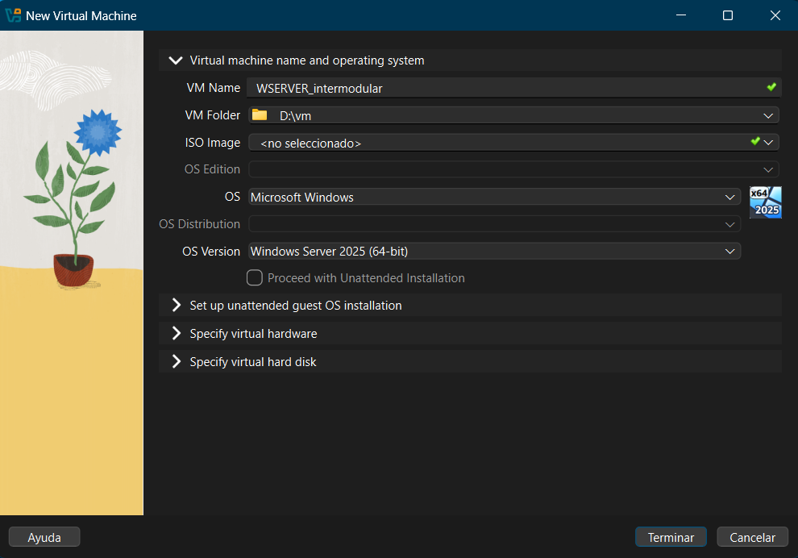

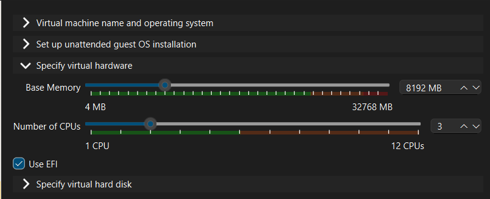

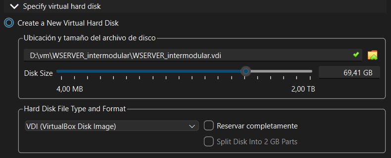

Antes de iniciar la maquina debemos configurar la red con adaptador puente , y añadir la imagen al almacenamiento para ejecutarla.Tambien añadiremos 4 discos extra para hacer un Raid 10, esto garantizará máxima velocidad de lectura/escritura y tolerancia a fallos físicos.

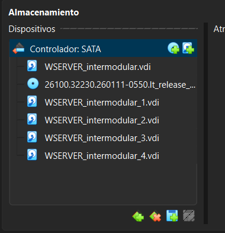

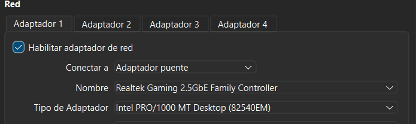

# 3: Instalación del sistema operativo

En este apartado se documenta el proceso técnico de instalación del sistema operativo base para la infraestructura de BugiSoft.

---

## 3.1. Inicio del instalador y selección de edición
Se inicia la máquina virtual desde la imagen ISO de Windows Server 2025. 

En el asistente, seleccionamos la versión "Datacenter con Experiencia de Escritorio" para facilitar la administración técnica del estudio.

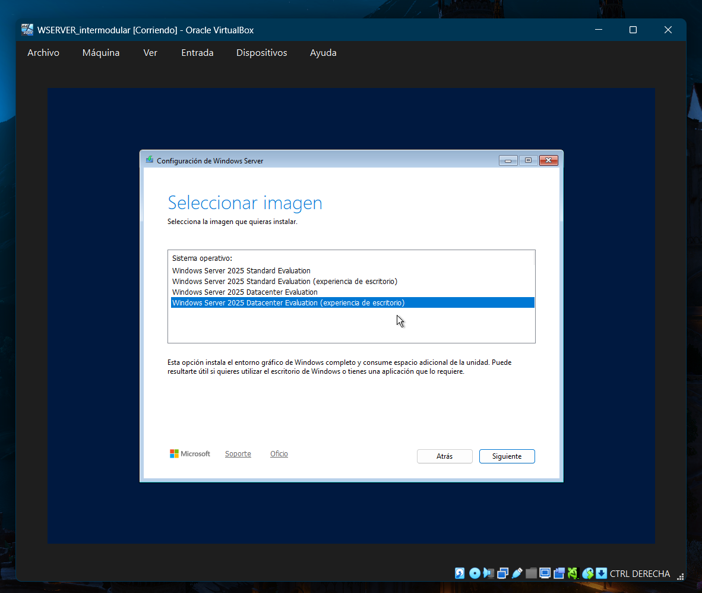

## 3.2. Selección de la unidad de destino
Se identifica el disco de 70 GB creado específicamente para alojar el sistema operativo y lo instalo ahi

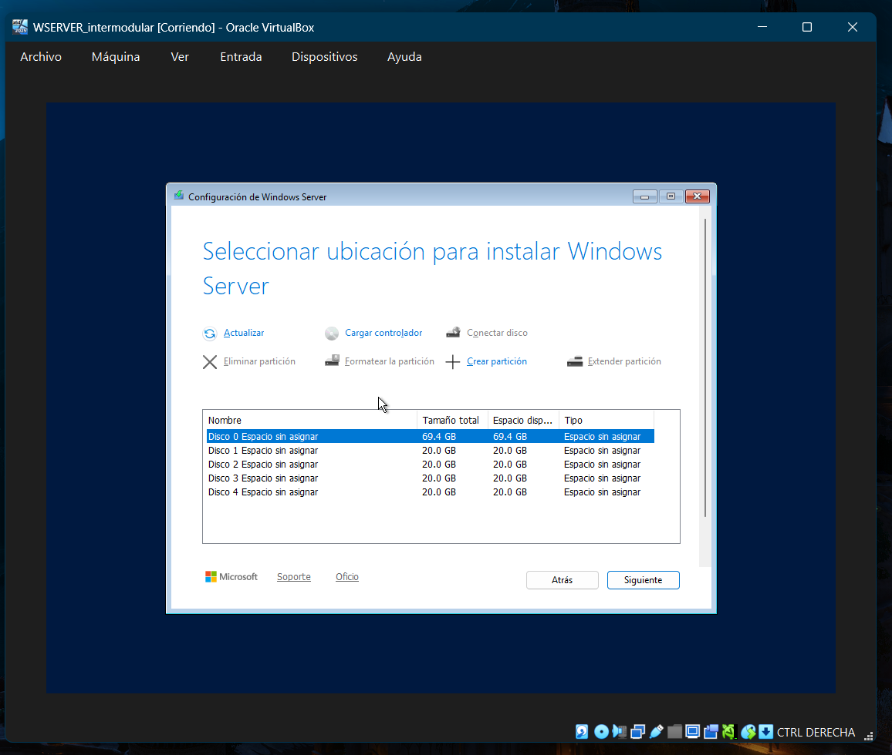

Despues de esto le damos a aceptar y se inicara la instalacion de Windows Server y esperaremos a que termine.

## 3.3. Finalización y comprobación de arranque
Tras el reinicio automático, se establece la contraseña de la cuenta de Administrador siguiendo los protocolos de seguridad iniciales(en este caso voy a poner **Windows.**). Se inicia sesión para confirmar que el escritorio y el Administrador del Servidor cargan correctamente.

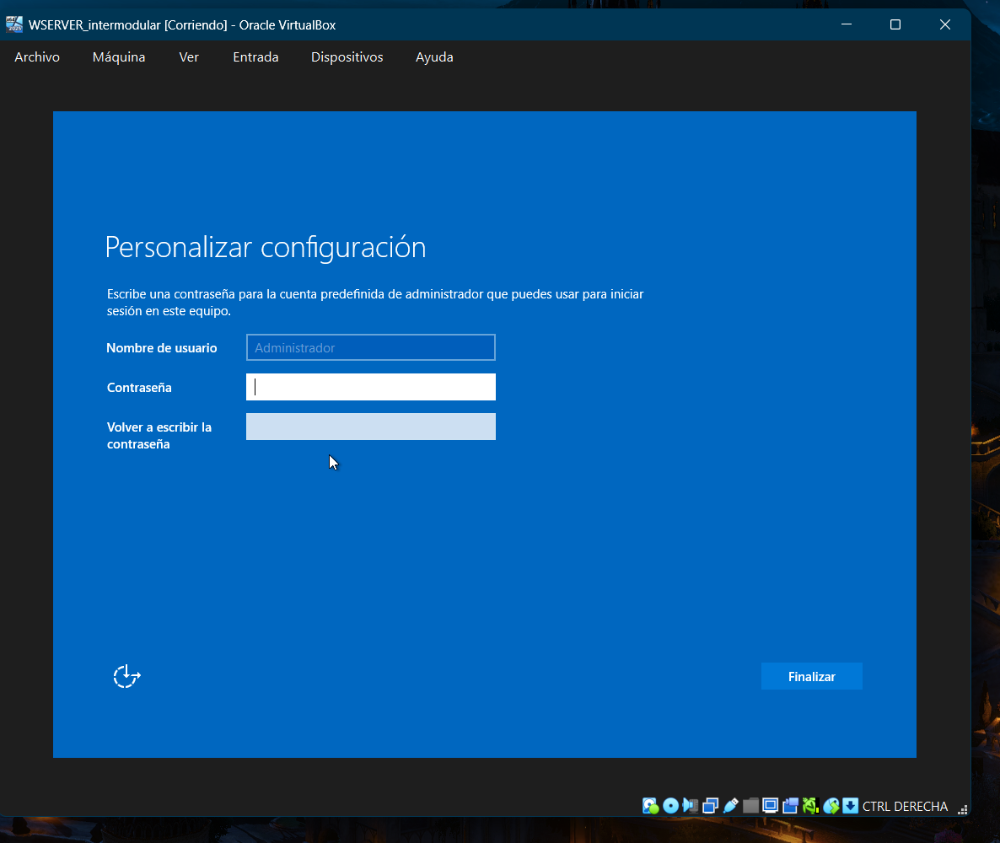

Despues ya estaremos en la pantalla de inicio y pondremos nuestra contraseña establecida anterioremente.A partir de aqui pasamos a la configuracion del sistema

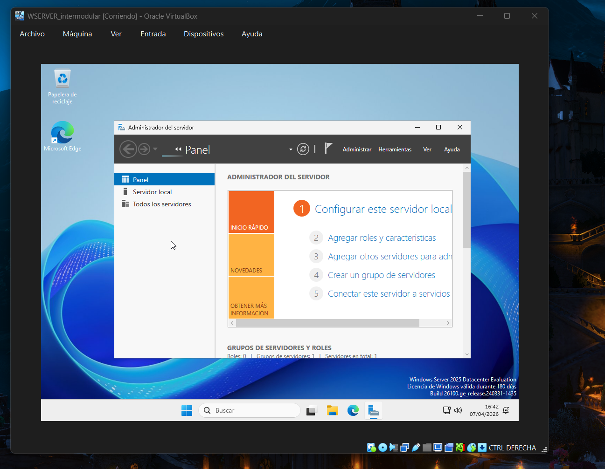

# ⚙️ Punto 4: Configuración del sistema

Tras completar la instalación de Windows Server 2025, se procede a realizar las configuraciones básicas necesarias para que el servidor sea funcional y seguro dentro de la infraestructura de la empresa

---
## 4.1. Nombre del equipo

Para una correcta identificación en la red del estudio, se cambia el nombre genérico del servidor por uno estandarizado.

* **Nombre asignado:** `SRV-DATA-01`
* **Descripción:** Servidor principal de identidades y recursos.

Vamos a Administracion del Servidor ----> Servidor local---->En la ventana propiedades del sistema pulsamos cambiar

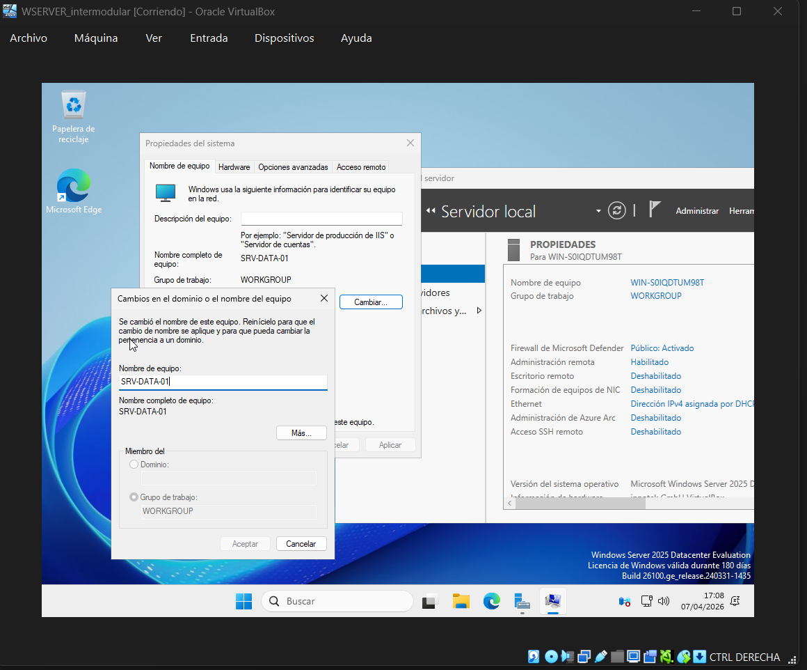

## 4.2. Configuración de red (Conectividad Inicial)

Se establecen los parámetros de red estáticos para la VLAN 60. Se utiliza un DNS externo temporalmente para validar el acceso a servicios de actualización.

* **Dirección IP:** `192.168.60.2`
* **Máscara de subred:** `255.255.255.0`
* **Puerta de enlace:** `192.168.60.1`
* **Servidor DNS:** `8.8.8.8` (Configurado para permitir salida a internet y descarga de parches).
* **DNS Final :** Se cambiará a `127.0.0.1` tras configurar el Controlador de Dominio.

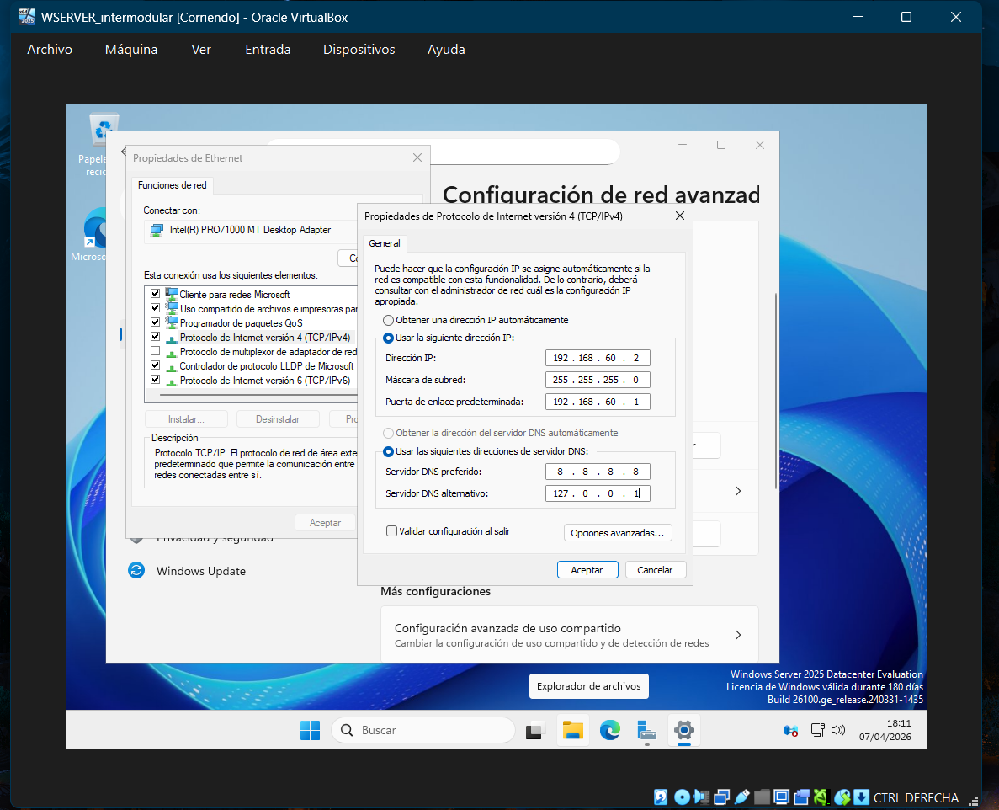

## 4.3. Actualizaciones del sistema

Se gestionan las actualizaciones de seguridad a través de Windows Update para proteger el servidor frente a vulnerabilidades antes de su despliegue final.

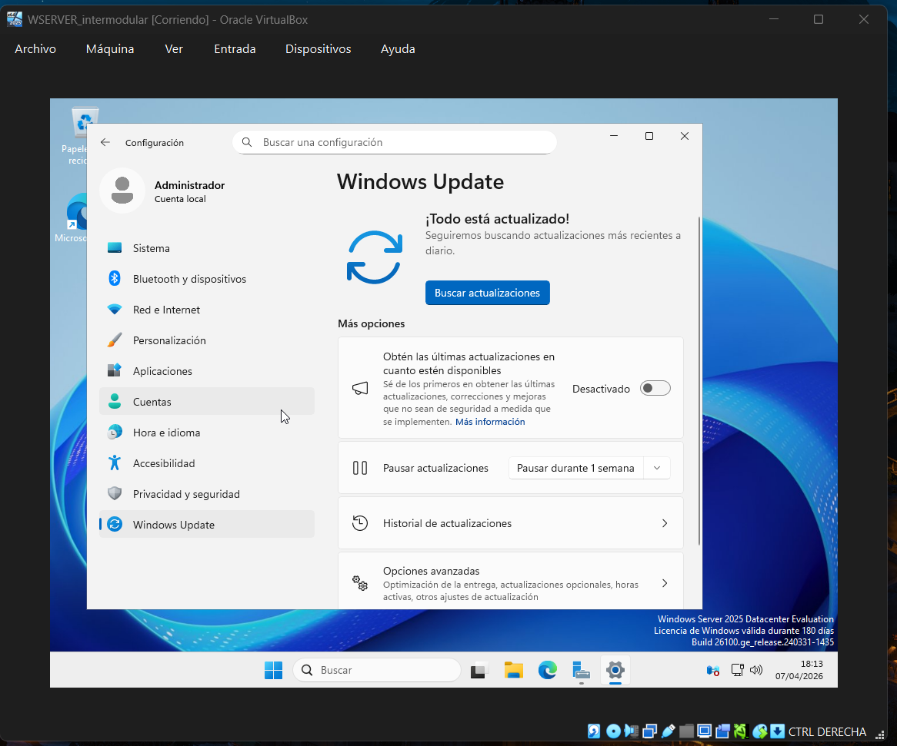

## 4.4. Instalación de paquetes y software necesario
Para mejorar la operatividad de la máquina virtual y la gestión del servidor, se instala el software base requerido.

* **Software instalado:** VirtualBox Guest Additions y los paquetes "AD DS" , "DNS" y "Servicios de archivos"

Hay que reiniciar despues de este proceso:
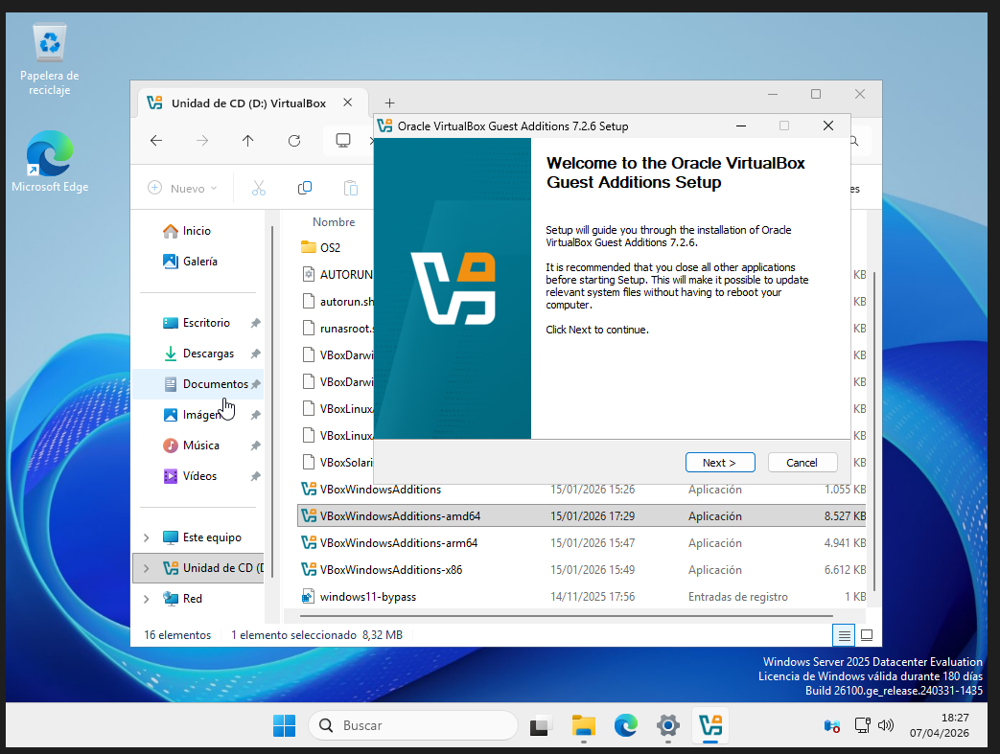

En Administracion del Servidor instalamos los paquetes(agregar roles y caracteristicas):

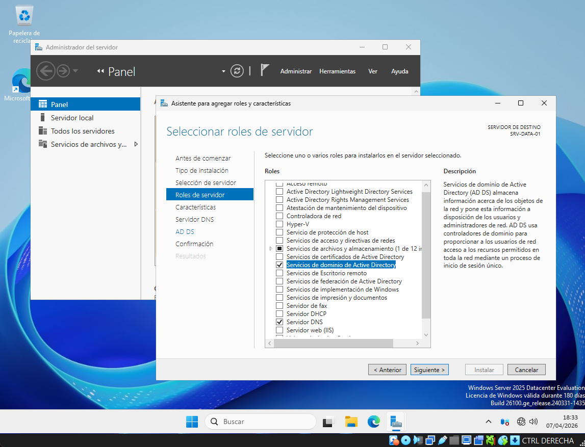

Despues de esto le damos a instalar y esperamos a que todos los complementos esten instalados:

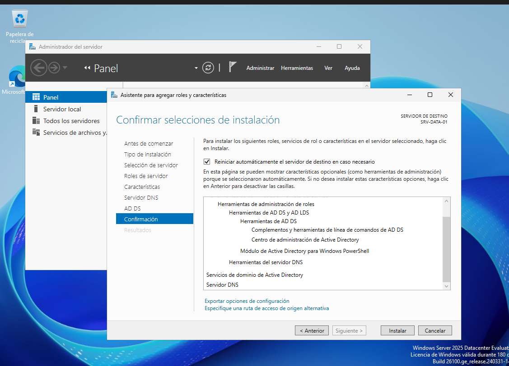

# 👥 Punto 5: Gestión de usuarios y permisos

En esta fase se documenta la administración de identidades y accesos dentro del servidor.El objetivo es demostrar la capacidad para organizar un entorno profesional mediante una estructura jerárquica de usuarios y grupos.

---

## 5.1. Organización de usuarios según roles
He creado Unidades Organizativas que permiten agrupar a los usuarios según su función dentro del estudio de videojuegos.

* **Estructura de OUs**:
    * `Administracion`: Personal de gestión empresarial.
    * `Desarrollo`: Programadores y artistas técnicos.
    * `Soporte`: Técnicos encargados del mantenimiento de la infraestructura.

Para ello promocionaremos a AD:

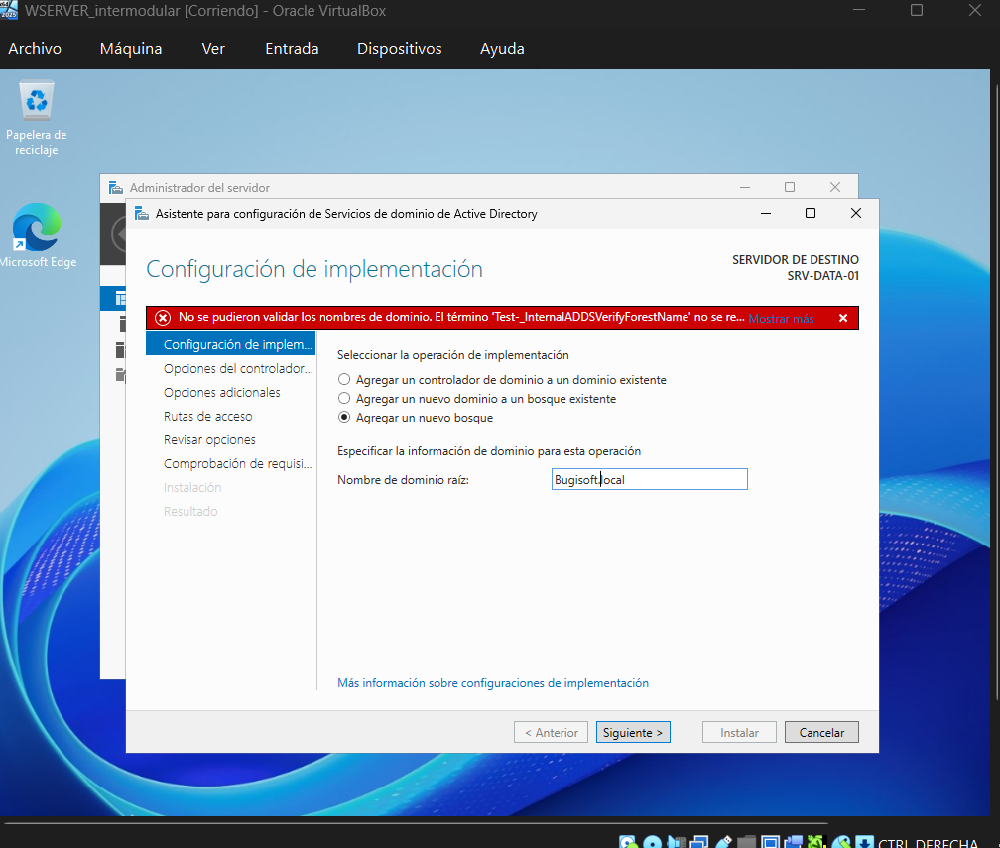

Elegimos el nivel funcional a Windows Server 2025 y una contraseña **Windows.**

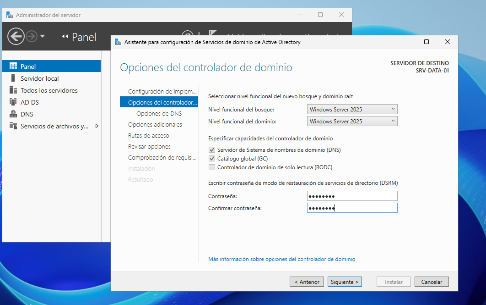

Le vamos dando a siguiente hasta acabar y que se termine la promocion a AD y despues de que reinicie el equipo vamos a crear las OUs

Vamos en el apartado herramientas a **Usuarios y equipos de Active Directory** , click derecho en nuestro bosque y crear unidad organizativa(creamos las 3)

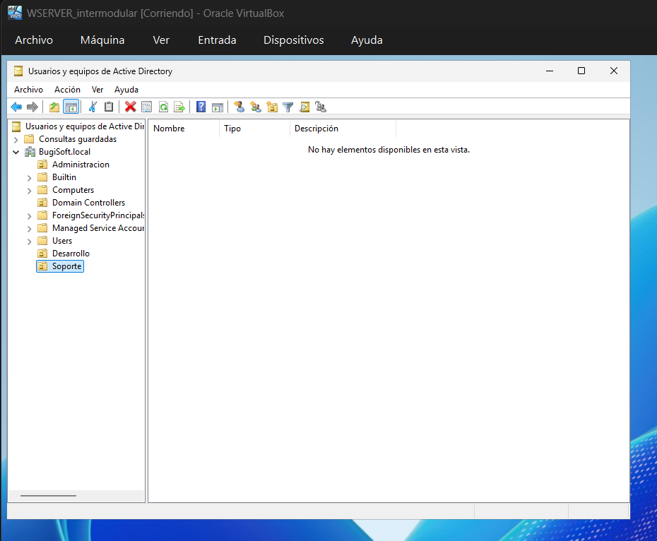

## 5.2. Configuración de Grupos de Seguridad
Se han implementado grupos de seguridad para facilitar la asignación de permisos de forma colectiva.

* **Metodología**: Uso de grupos de seguridad globales para organizar a los usuarios por niveles de acceso.
* **Grupos implementados**:
    * **Developers**: Miembros con acceso a los repositorios de código y activos de videojuegos.
    * **Sistemas**: Personal con privilegios para la gestión técnica del servidor `BUGISRV01`.
    * **Staff**: Acceso general a los recursos comunes de la oficina.

Ahora en cada OU vamos creando un grupo de seguridad, que sirven para dar permisos a varias personas a la vez sin tener que ir uno por uno

Asi estaria configurado:

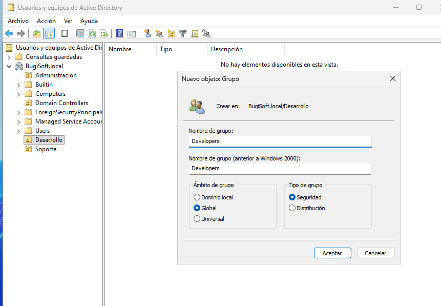

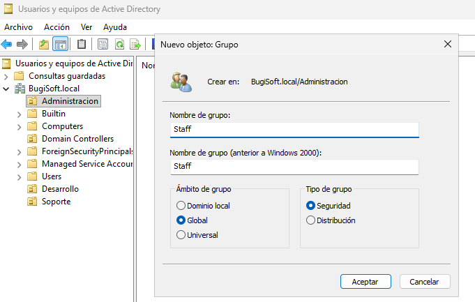

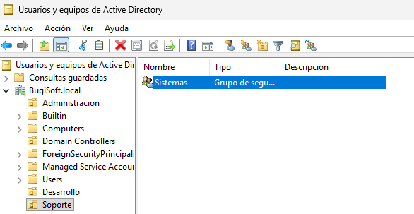

## 5.3. Creación de usuarios
Se procede al alta de cuentas individuales para los empleados de BugiSoft, ubicándolos en sus respectivas Unidades Organizativas para mantener la jerarquía del sistema.

* **Metodología**: Creación de objetos de usuario con nombres de inicio de sesión normalizados .
* **Usuarios de ejemplo**:
    * **Desarrollo**: `dev.admin` (Administrador de motores de juego).
    * **Soporte**: `it.tecnico` (Mantenimiento de infraestructura).
    * **Administración**: `gestor.bugi` (Personal de oficina).

Creamos estos 3 usuarios en cada OU(bastante sencillo el proceso) y asignamos las contraseñas (ej: BugiSoft.123) en cada usuario y marcamos la opcion que nunca expire

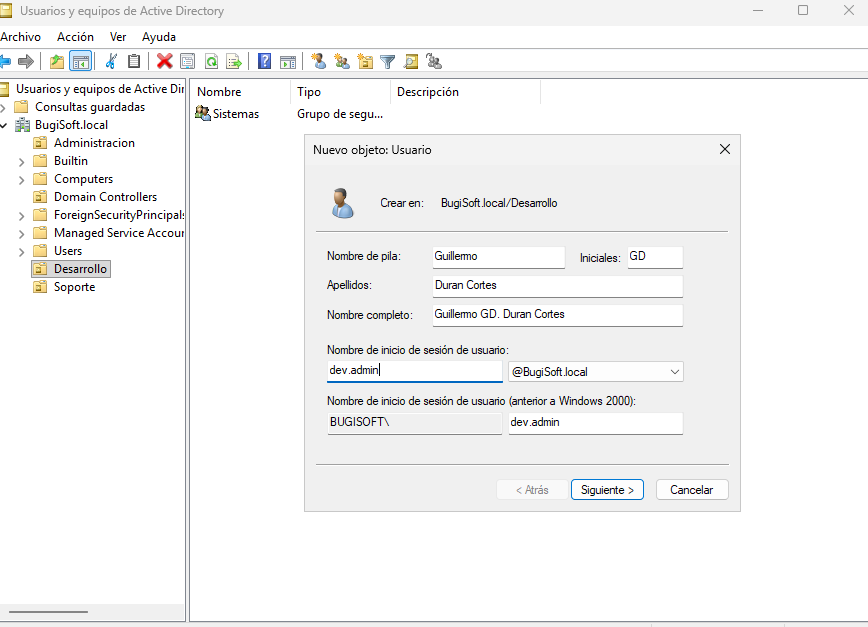

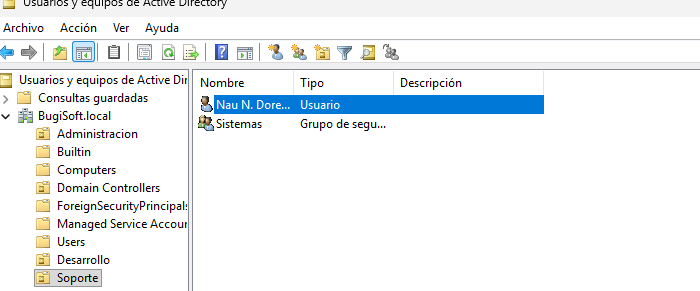

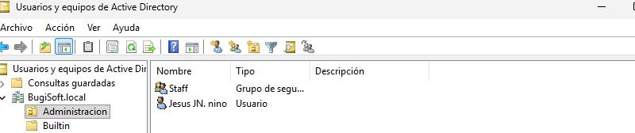

## 5.4. Asignación de permisos y roles
Para simular la gestión real, vinculo a cada empleado con su grupo de seguridad correspondiente para que hereden los permisos de su rol:

1.  **Nau** es miembro del grupo `Sistemas`.
2.  **Guillermo** es miembro del grupo `Developers`.
3.  **Jesus** es miembro del grupo `Staff`.
   
Aqui seria un ejemplo :

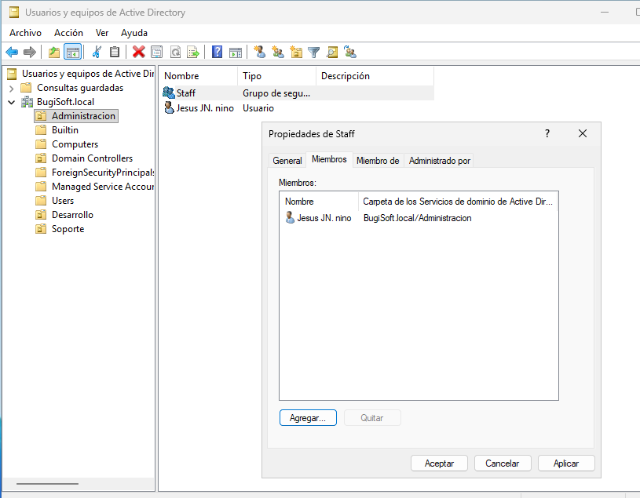

# 🛠️ Punto 6: Servicios básicos del sistema

## 6.1. Compartición de archivos (File Server)
Configure un servidor de archivos centralizado para que el equipo de desarrollo pueda intercambiar activos del juego.

* **Estructura**: Carpeta raíz `C:\Recursos_BugiSoft`.
* **Configuración de red**: Recurso compartido como `\\Proyectos_Dev`.
* **Gestión de permisos**:
    * **Guillermo**: Permisos de Modificación  para subir código y modelos 3D.
    * **Nau**: Control total para tareas de mantenimiento y backup.

Aqui seria la comparticion de recursos a mi:

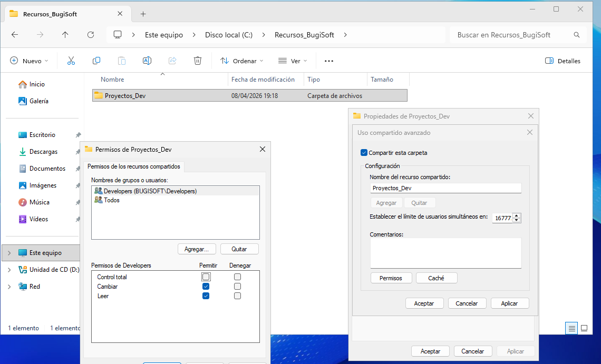

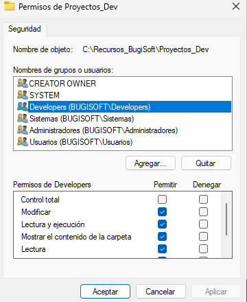

Obviamente tambien deshabilitamos la herencia (Esto es para que solo entren quienes yo diga).

Acto seguido añadimos a Nau y le damos el control total

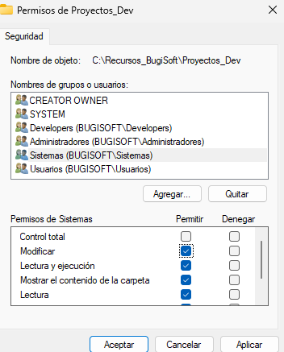

## 6.2. Configuración de Acceso Remoto (RDP)
Para facilitar la administración del servidor BUGISRV01 sin necesidad de acceso físico, se habilita el RDP.

* **Configuración del sistema**: Se ha activado el acceso remoto permitiendo conexiones solo con Autenticación a nivel de red  para garantizar la seguridad.
* **Gestión de accesos**: 
    * Se ha autorizado específicamente al grupo `Sistemas` (donde se encuentra **Nau**).
    * Se ha verificado que el Firewall de Windows permite el tráfico por el puerto **TCP 3389**.

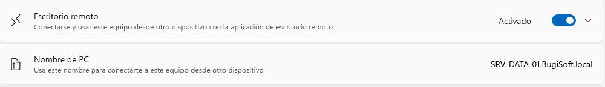

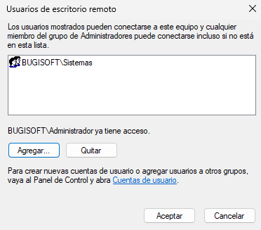

## 6.3. Servicios de red básicos (Servidor DNS)
El servicio DNS es fundamental para la infraestructura de , ya que permite la resolución de nombres dentro de la red local, facilitando la conexión de los puestos de trabajo de Nau, Guillermo y Jesus.

* **Estado del servicio**: Instalado y configurado automáticamente durante la promoción del controlador de dominio.
* **Zona de búsqueda directa**: Se ha verificado la existencia de la zona `bugisoft.local`.

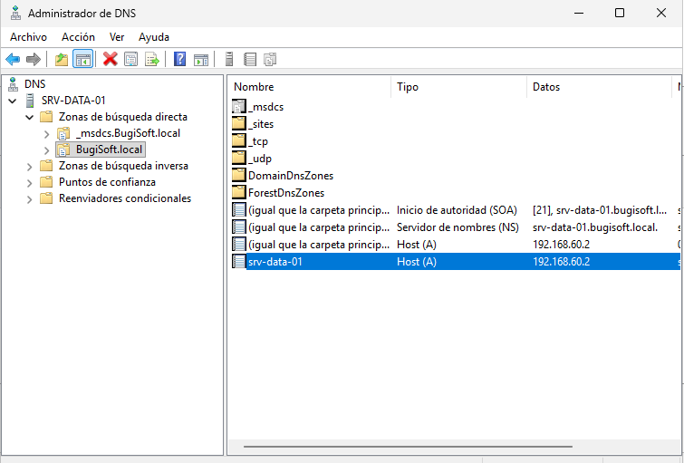

## 6.4. Gestión de procesos y servicios del sistema
Basicamente aqui se monitoriza los procesos y recursos de todo el sistema, esto es tremendamente vital para la empresa.

* **Servicios monitorizados**:
    * **Servicios de dominio de Active Directory **: El núcleo de la autenticación de Nau, Guillermo y Jesus.
    * **Servidor DNS**: Crucial para la resolución de nombres en la red local.
* **Metodología de gestión**:
    * Se utiliza la consola `services.msc` para verificar que el tipo de inicio sea **Automático**.
    * Se emplea el **Administrador de tareas** para supervisar que el proceso `lsass.exe` mantiene un consumo de recursos estable.