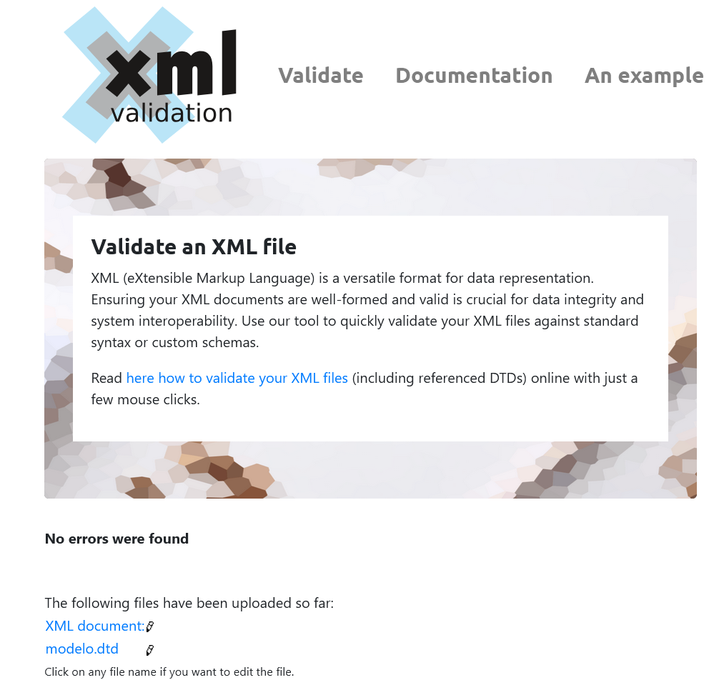
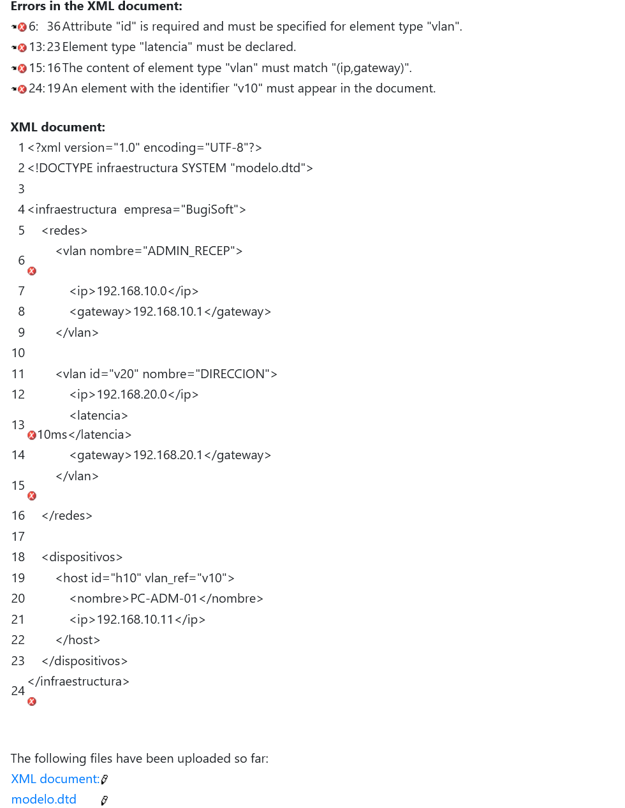
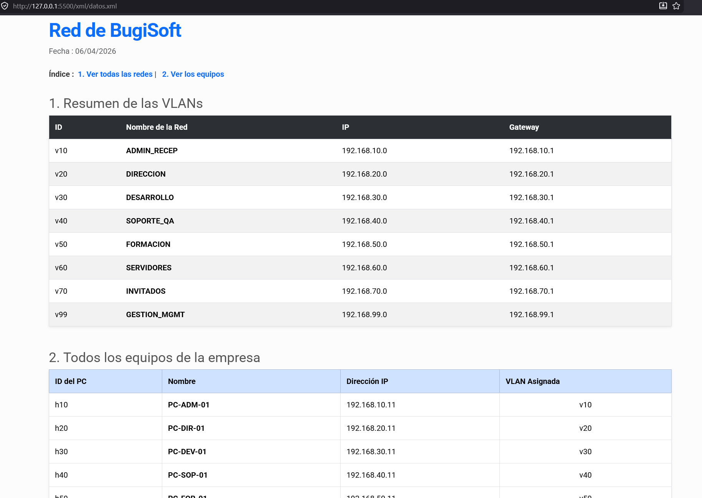

#  Proyecto de Infraestructura XML - BugiSoft

## 1. Representación de los Datos
El archivo `datos.xml` tiene basicamente las tablas con las Vlans y los primeros dispositivos de cada red de mi empresa **BugiSoft** . 
* **Redes:** Define cada VLAN con su ID único, nombre del departamento, dirección IP de red y su respectiva puerta de enlace.
* **Dispositivos:** Lista los hosts finales vinculándolos a su red correspondiente mediante el atributo `vlan_ref`, tambien tienen su id y la ip asociada.

## 2. Validación con DTD (`modelo.dtd`)
La validación asegura que el XML cumpla con todas las reglas.
* **Reglas aplicadas:** El atributo `id` es obligatorio (`#REQUIRED`), y la estructura de cada VLAN debe seguir estrictamente el orden secuencial de `<ip>` seguido de `<gateway>`.
* **Proceso de validación:**  Al introducir un error (como una etiqueta `<latencia>` no definida o la omisión de un ID) el metodo de validacion escogido(mejor el online) me indica los innumerables errores que tenia el documento, tambien el mismo proceso indica que el archivo `datos.xml` no tiene ningun error.

## 3. Transformación XSLT y Visualización
Para convertir los datos en algo potable, se utiliza la hoja de estilos `transform.xsl`.
* **Ejecución:** El navegador (Firefox es el mio) actúa como motor de transformación al leer la instrucción de procesamiento en la cabecera del XML.
* **Diseño y Estilo:** * Se integra **Bootstrap 5** de forma local para el diseño de tablas y contenedores.
* Se utiliza un archivo **CSS personalizado** (`estilo.css`) para aplicar la tipografía **Roboto** y meter algunos margenes y espaciados(nada complejo).

## 4. Evidencias del Proyecto
Se aportan las siguientes evidencias visuales del funcionamiento del sistema:
* **Validación Correcta:** Captura del validador online confirmando que el XML cumple con la DTD.

* **Validación Incorrecta:** Pantallazo validador online donde se aprecia cómo la DTD bloquea elementos no permitidos o falta de atributos obligatorios.

* **Visualización Final:** Captura del navegador mostrando el HTML renderizado bonito.

## 5. Integración en el proyecto

Mas o menos este XML tiene algunas integraciones útiles con el resto del propyecto que he estado haciendo:

* **Conexión con Redes :** El XML sirve como documentación técnica de la infraestructura diseñada en el módulo de Redes. Gracias a la transformación XSLT, un administrador de red puede generar de forma instantánea un inventario visual de las VLANs y equipos de mi empresa.
  
* **Programación :** Incluí una exportación en formato **JSON** (`datos.json`) diseñada para ser consumida por scripts de automatización . Esto permitiría, por ejemplo, automatizar la creación de usuarios en un Directorio Activo.

* **Gestión de Datos :** El uso de XML y JSON permite la portabilidad de la información hacia sistemas de Bases de Datos. 

* **Mantenimiento:** Al separar los datos ) de la estructura  y de la presentación , el sistema es totalmente escalable; si la empresa inventada crece, basta con añadir nuevos nodos al XML

